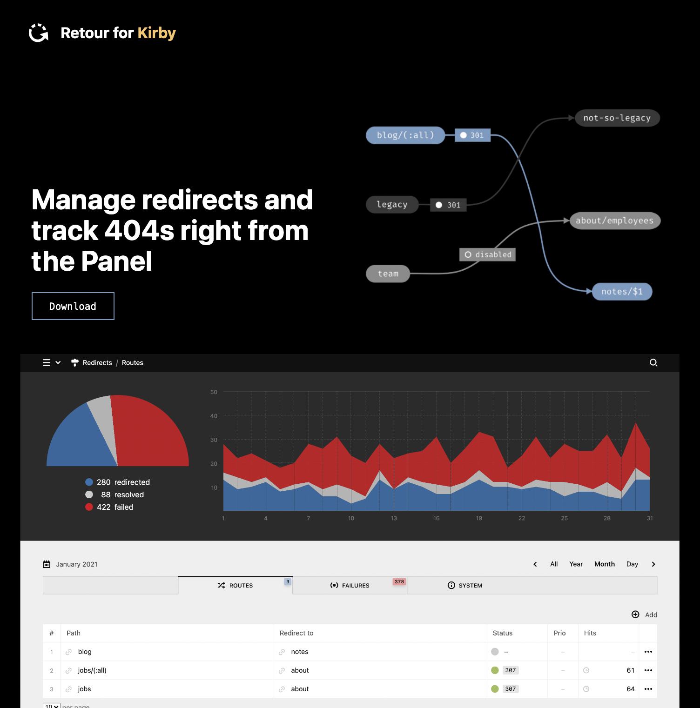

> **✋ Pre-release**  
> Retour 4.0 is currently in pre-release and the only supported version in active development. 
> It would be great if you could help testing (please report [issues](https://github.com/distantnative/retour-for-kirby/issues)) but please test with care.
> Retour 4.0 is a breaking change - start with the release notes. 
 <br>
 
 
# Retour for Kirby

[](https://github.com/distantnative/retour-for-kirby/releases)
[](https://getkirby.com/)
[](https://codecov.io/gh/distantnative/retour-for-kirby)
[](https://paypal.me/distantnative)

[](https://distantnative.com/retour)

## Getting started

### Installation
[Download](https://github.com/distantnative/retour-for-kirby/archive/main.zip), unzip and copy this repository to `/site/plugins/retour`.

Alternatively, you can install it with composer:

```bash
composer require distantnative/retour-for-kirby
```

### Updates
Make backups of the redirects config and database.

```
/site/config/retour.yml
/site/logs/retour/log.sqlite
```

After that, replace the `/site/plugins/retour` folder with the new version. Make sure to read the release notes for breaking changes.

Or if you installed the plugin via composer, run:

```bash
composer update distantnative/retour-for-kirby
```

## Routes
Retour lets you manage redirect routes right from the Panel – all through a familiar UI.

### Adding a redirect


#### Path
is the path after your site's URL that you would like to catch and redirect.
It can be a static path, e.g. team, or you can use placeholders to define dynamic redirects, e.g. `blog/(:all)`.
Dynamic redirects use Kirby's route patterns as placholder.

Only paths without existing pages or custom routes can be redirected.

#### Redirect to
is the target of your redirect. There are four options what to enter in this field:

- relative path inside your site (e.g. `blog/2018/a-nice-story`)
- URL of an external website (e.g. `https://getkirby.com`)
- `error` to return the site's error page
- leave the field empty to let the browser request fail (for HTTP status codes not in the `3xx` range)

```
project/(:any)/photos  =>  project/$1/gallery
blog/(:any)/(:all)     =>  notes/$1/entries/$2
```

#### Status
refers to the [HTTP status code](https://httpstatuses.com/) the redirect will respond with.

- Only status codes in the `3xx` range will actually redirect the request to the new location (URL in browser actually changes).
- All other status code options either return the target page at the specified path (URL stays the same); or the browser request fails with the selected HTTP status code (empty `Redirect to` field).
- If you select the `disabled` option, the redirect is ignored.

#### Priority
If the priority flag is activated, the redirect route will overrule any actuaylly existing pages as well.

## Failures log
### Timeframe
When you open up Retour, you will be shown the data of the current month. The selected timeframe not only applies to the graphs, but also the data displayed in the tables.

You can change the timeframe by using the navigation bar: moving between previous and next month or even changing the span to a full year or only a day.

### Resolving a failure
You can choose from the dropdown menu of a failure entry (three dots to the right), to create a new redirect route which will be pre-filled with the path to prevent any more failing requests in the future.

Once you save that new route, all failure entries for that path will also be marked as resolved in the stats.

### Clearing logs
Depending on your use case, you might want to clear the logs from time to time.
This can be either done manually by clicking the button above the failures table:


Or automatically via the `distantnative.retour.deleteAfter` option.

## Options
### Config
The following config options are available:

```php
// site/config/config.php

'distantnative.retour' => [

  // En-/disable all logging (true/false)
  'logs' => true,

  // Array of paths to ignore as 404s
  'ignore' => [],

  // Number of months after which logs should be deleted automatically
  'deleteAfter' => false,

  // Absolut path for location of redirects config
  // Default: site/config/retour.yml
  // (allows for yml and json files/formats)
  'config' => ...,

  // Absolut path for location of database
  // Default: $kirby->root('logs) + /retour/log.sqlite
  'database' => ...,
]
```

### Permissions
Moreover, Retour obeys to the following user blueprint permissions:

```yaml
title: Editor

permissions:
 access:
   retour: false
```

## Translations
Retour has been translated into some more languages, thanks to the following contributors:

- English
- German
- French: [sylvainjule](https://github.com/sylvainjule)
- Brazilian Portuguese: [pedroborges](https://github.com/pedroborges)
- Turkish: [afbora](https://github.com/afbora)

## Troubleshooting
This plugin is provided "as is" with no guarantees. Use it at your own risk and always test it yourself before using it in a production environment. If you encounter any problem, please [create an issue](https://github.com/distantnative/retour-for-kirby/issues).

### PDOException: could not find driver
If you encounter this error message, it most likely means that SQLite is not installed, as mentioned in [this issue](https://github.com/distantnative/retour-for-kirby/issues/160) (with example how to fix).

## Pay it forward 💛
This plugin is completely free and published under the MIT license. However, development needs time and effort. If you are using it in a commercial project or just want to support me to keep this plugin alive, please [make a donation of your choice](https://paypal.me/distantnative).
